## Lecture Roadmap

:::: {.columns}
::: {.column width="50%"}
- **2.1** Signal — concept, types, acquisition, properties
- **2.2** Resistance to voltage: Wheatstone bridge
- **2.3** Noise — types and signal-to-noise ratio
:::
::: {.column width="50%"}
- **2.4** Digital signal processing
- **2.5** Fourier transform: DFT and FFT
- **2.6** Inverse Fourier transform
- **2.7** Data presentation
:::
::::

::: {.notes}
Set the frame: a measurement is only useful if the signal can be conditioned,
converted and processed reliably. Every section answers one link in that chain.
:::

## Learning Objectives

By the end of this chapter you should be able to:

- Classify a signal as analog, discrete-time or digital and list the properties of a digital signal
- Describe the signal acquisition chain from physical quantity to stored data
- Analyse a Wheatstone bridge, derive its balance condition and compute its output voltage
- Identify the dominant noise types in a measurement channel
- Compute and interpret the signal-to-noise ratio
- Explain the purpose of DSP and apply the DFT and FFT to move between time and frequency domains
- Reconstruct a signal using the inverse Fourier transform
- Select an appropriate chart or table for presenting measurement data

::: {.notes}
Read the objectives quickly; they map one-to-one onto the slides that follow.
:::

## Why This Chapter Matters

- A sensor rarely produces a signal a computer can use directly.
- A **strain gauge** gives a resistance change of a fraction of an ohm.
- A **thermocouple** gives a few millivolts buried in noise.
- Mains pick-up, thermal noise and interference corrupt every real channel.
- Between the sensor and the decision there is a chain:

$$\text{physical quantity} \;\rightarrow\; \text{sensor} \;\rightarrow\; \text{conditioning} \;\rightarrow\; \text{ADC} \;\rightarrow\; \text{DSP} \;\rightarrow\; \text{decision}$$

**This chapter is about that chain.**

::: {.notes}
Ask students: "What is the smallest voltage your phone's microphone preamplifier
must handle?" Bring out that conditioning is what makes measurement possible.
:::

# 2.1 Signals

## What Is a Signal?

A **signal** is a physical quantity that carries information and varies with an
independent variable — usually time.

- **Amplitude** — the value of the quantity at a given instant
- **Information** — the meaningful part of the variation
- **Carrier** — the physical medium (voltage, current, pressure, light)

Examples:

- Voltage across a thermocouple as a furnace heats up
- Current from a photodiode as light intensity changes
- Pressure at a hydraulic test point during a pump cycle

::: {.notes}
Stress that a signal is a *representation* of a physical quantity, not the
quantity itself. The sensor performs the first translation.
:::

## Types of Signal

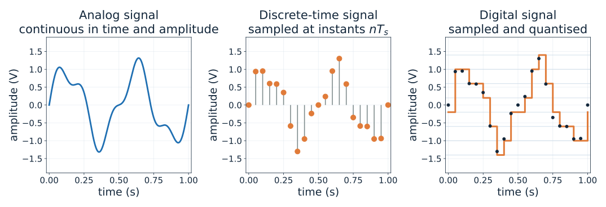{width="87%"}

::: {.notes}
Walk across the three panels:
(1) analog — continuous in both time and amplitude;
(2) discrete-time — defined only at sampling instants $nT_s$;
(3) digital — defined at sampling instants *and* restricted to a finite set of
amplitude levels.
Ask: "Which of these can a microcontroller store?" — only the third.
:::

## Signal Acquisition Chain

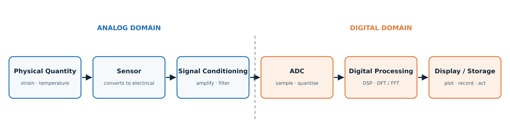{width="95%"}

::: {.notes}
Emphasise the domain boundary. Everything to the left is analog and continuous;
everything to the right is numeric. The ADC is the interface that changes the
representation — and it is where information can be lost forever.
:::

## Properties of a Digital Signal

:::: {.columns}
::: {.column width="52%"}
- **Sampling rate** $f_s$ — how often the signal is measured (Hz)
- **Sampling interval** $T_s = 1/f_s$
- **Resolution** $N$ bits — number of amplitude levels $2^N$
- **Quantisation step** $\Delta = V_{FS}/2^{N}$
- **Quantisation error** $\le \pm \Delta/2$
- **Frequency resolution** $\Delta f = f_s/N = 1/T_{record}$
- **Record length** $N$ samples
:::
::: {.column width="48%"}
**Signal-to-quantisation-noise ratio**

$$\mathrm{SQNR} \approx 6.02\,N + 1.76 \ \text{dB}$$

| Bits $N$ | SQNR (dB) |
|:---:|:---:|
| 8  | 50 |
| 12 | 74 |
| 16 | 98 |
| 24 | 146 |

:::
::::

::: {.notes}
Every bit of resolution buys roughly 6 dB of dynamic range. Ask students what a
12-bit ADC with a 5 V range gives: $\Delta = 5/4096 \approx 1.22$ mV.
:::

## Sampling and Quantisation

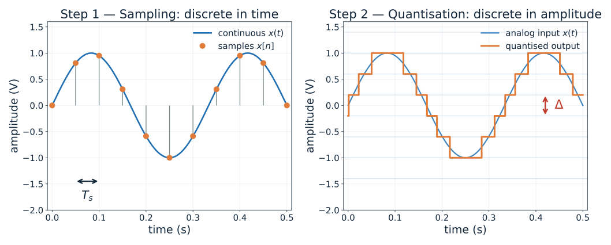{width="85%"}

::: {.notes}
Sampling discretises **time**; quantisation discretises **amplitude**.
Sampling loses information only if the sampling theorem is violated.
Quantisation always loses a small amount of information — that is the
quantisation error $\pm\Delta/2$.
:::

## The Sampling Theorem and Aliasing

::: {.fragment}
**Sampling theorem:** a signal band-limited to $f_{max}$ can be reconstructed
exactly only if

$$f_s > 2 f_{max}$$

The frequency $f_s/2$ is the **Nyquist frequency**.
:::

::: {.fragment}
If $f_s < 2f$, a component at $f$ appears at the **alias frequency**

$$f_{alias} = \left| f - k f_s \right| \quad \text{for the integer } k \text{ giving } f_{alias} \le f_s/2$$
:::

::: {.fragment}
**Aliasing is irreversible** — once a component folds into the baseband it
cannot be separated from the genuine low-frequency content.
:::

::: {.notes}
Worked instance for the next figure: $f = 7$ Hz, $f_s = 10$ Hz, so
$f_{alias} = |7 - 10| = 3$ Hz. The two waveforms share identical samples.
:::

## Aliasing Demonstrated

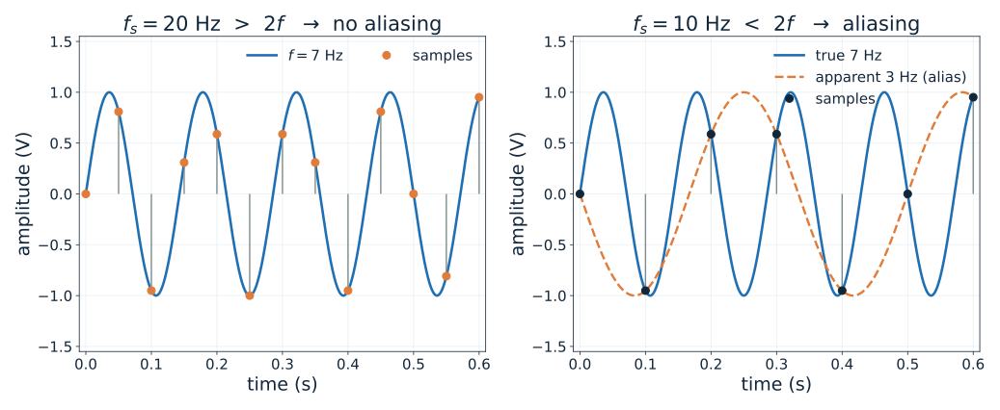{width="85%"}

::: {.notes}
Left: $f_s = 20$ Hz satisfies $f_s > 2f$ and the samples define the 7 Hz wave
uniquely. Right: $f_s = 10$ Hz violates the theorem and the very same sample
values are produced by a 3 Hz component (with inverted phase).
Point out that no amount of later digital processing can undo this.
:::

## Check Your Understanding

1. A 4–20 mA pressure transmitter is sampled at 100 Hz. What is the highest
   frequency that can be represented without aliasing?

2. A 16-bit ADC has a 10 V full-scale range. What is $\Delta$, and what is the
   maximum quantisation error?

3. Why is an **anti-aliasing filter** placed *before* the ADC rather than
   implemented digitally afterwards?

::: {.notes}
Answers: (1) 50 Hz. (2) $\Delta = 10/65536 \approx 153\ \mu$V, error
$\le \pm 76.5\ \mu$V. (3) Aliased components have already become
indistinguishable from genuine baseband content once sampled.
:::

# 2.2 Resistance to Voltage Conversion

## Why Convert Resistance to Voltage?

Many of the most common sensors are **resistive**:

| Sensor | Quantity | Typical change |
|:---|:---|:---|
| Strain gauge | strain | $\Delta R/R \sim 10^{-3}$ |
| RTD (Pt100) | temperature | $\Delta R/R \sim 10^{-1}$ |
| Thermistor | temperature | $\Delta R/R \sim 10^{-1}$ |
| LDR | light | $\Delta R/R \sim 10^{0}$ |

Data acquisition systems and ADCs measure **voltage**, not resistance.

$$\text{resistance change} \;\longrightarrow\; \text{voltage signal} \;\longrightarrow\; \text{amplification} \;\longrightarrow\; \text{ADC}$$

::: {.notes}
A simple series resistor also converts resistance to voltage, but it produces a
large offset and drifts with temperature. The Wheatstone bridge removes the
offset at balance.
:::

## The Wheatstone Bridge

:::: {.columns}
::: {.column width="55%"}
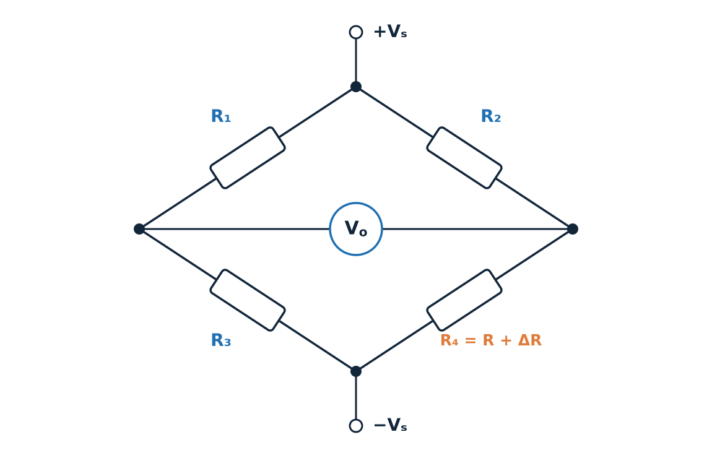{width="100%"}
:::
::: {.column width="45%"}
- Four arms $R_1, R_2, R_3, R_4$
- Excitation $V_s$ applied between the top and bottom nodes
- Output $V_o$ taken between the left and right nodes
- **Balance condition:**

$$R_1 R_4 = R_2 R_3 \quad\Longleftrightarrow\quad \frac{R_1}{R_2} = \frac{R_3}{R_4}$$

- At balance, $V_o = 0$ — the bridge measures only the **change**, not the absolute value
:::
::::

::: {.notes}
The bridge is a differential device. Because it outputs zero at balance, the
full ADC range is available for the small change we care about. This is the
central reason it is used everywhere in instrumentation.
:::

## Bridge Output Voltage

With $V_s$ across the top and bottom nodes and the output taken between the
left and right nodes:

$$V_o = V_s\left[\frac{R_3}{R_1+R_3} - \frac{R_4}{R_2+R_4}\right]$$

**Quarter bridge** — only $R_4$ is active, $R_4 = R + \Delta R$:

$$V_o = -\frac{V_s}{4}\cdot\frac{\Delta R/R}{1 + \tfrac{1}{2}\,\Delta R/R}$$

For small changes $\Delta R \ll R$:

$$\boxed{\;V_o \approx -\frac{V_s}{4}\cdot\frac{\Delta R}{R}\;}$$

::: {.notes}
Derive the exact expression on the board from the two voltage dividers.
Then show that the denominator tends to 1 for small $\Delta R/R$, giving the
familiar linear quarter-bridge relation. The minus sign simply indicates the
polarity of the output with the labelling used here.
:::

## Quarter-Bridge Response and Linearity

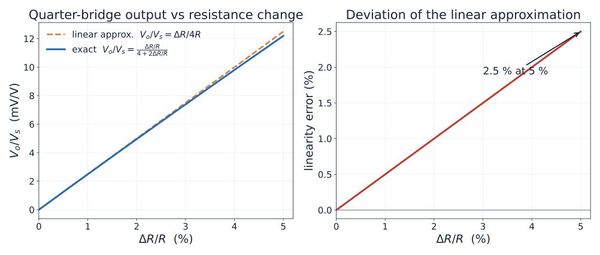{width="85%"}

::: {.notes}
The bridge is *not* perfectly linear. The linear approximation is excellent
below about 1 % resistance change (error under 0.5 %) and reaches only about
2.5 % error at a 5 % change. For strain gauges ($\Delta R/R < 0.2$ %) the
linear form is always adequate.
:::

## Worked Example — Strain Gauge on a Quarter Bridge

**Given**

- Strain gauge resistance $R = 350\ \Omega$
- Gauge factor $GF = 2.0$
- Applied strain $\varepsilon = 500\ \mu\varepsilon = 500\times10^{-6}$
- Bridge excitation $V_s = 5$ V

**Required** — bridge output $V_o$ and the gain needed to reach 1 V.

**Method** — $\dfrac{\Delta R}{R} = GF\cdot\varepsilon$, then $V_o \approx \dfrac{V_s}{4}\cdot\dfrac{\Delta R}{R}$

::: {.notes}
Do this on the board step by step. Insist that students write the units at
every line; the final answer is in millivolts and that is the whole point.
:::

## Worked Example — Solution

**Substitution**

$$\frac{\Delta R}{R} = 2.0 \times 500\times10^{-6} = 1.0\times10^{-3}$$

$$\Delta R = 350 \times 1.0\times10^{-3} = 0.35\ \Omega$$

$$V_o \approx \frac{5}{4}\times 1.0\times10^{-3} = 1.25\ \text{mV}$$

**Interpretation**

- The bridge output is only **1.25 mV** — far below a 5 V ADC range.
- The exact relation gives 1.2494 mV; the linear approximation is in error by
  less than 0.05 %.
- A gain of about **800** is required to bring the signal to 1 V.

**This is exactly why signal conditioning exists.**

::: {.notes}
Emphasise: 0.35 Ω out of 350 Ω is a 0.1 % change. The amplifier must recover a
1.25 mV signal while not amplifying the offset and drift by the same factor —
which is why instrumentation amplifiers and bridges are used together.
:::

# 2.3 Noise

## What Is Noise?

**Noise** is any unwanted disturbance that corrupts the information carried by
the signal. Unlike interference, most noise is random and cannot be predicted
sample by sample.

| Type | Physical origin | Spectrum |
|:---|:---|:---|
| Thermal (Johnson) | Random motion of charge carriers in any resistor | Flat (white) |
| Shot | Discrete arrival of carriers across a junction | Flat (white) |
| Flicker ($1/f$) | Traps, defects, slow drift in semiconductors | $\propto 1/f$ |
| Interference | Mains, motors, switching supplies | Discrete lines |
| Quantisation | Rounding in the ADC | Broadband, low level |

::: {.notes}
Distinguish random noise from deterministic interference. Interference can be
removed by filtering or shielding; random noise can only be reduced by
bandwidth limiting, averaging or cooling.
:::

## Noise Power Spectral Density

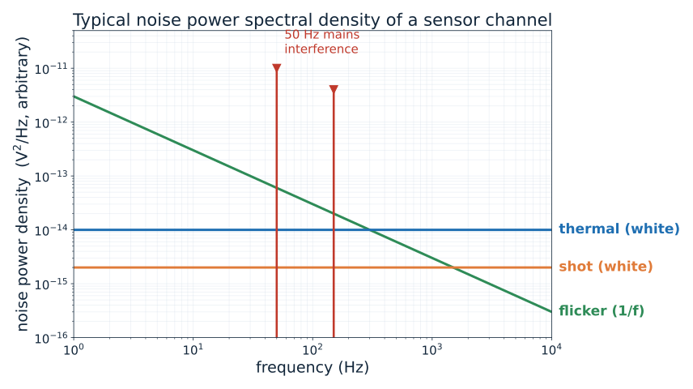{width="70%"}

::: {.notes}
Thermal and shot noise set a flat floor; flicker noise dominates at low
frequency; mains interference appears as discrete spikes at 50 Hz and its
harmonics. Practical consequence: keep the measurement out of the 1/f region
(modulation) and notch out the mains frequency.
:::

## Signal-to-Noise Ratio

$$\mathrm{SNR} = 10\log_{10}\frac{P_{signal}}{P_{noise}} = 20\log_{10}\frac{A_{signal,rms}}{A_{noise,rms}}\ \ \text{dB}$$

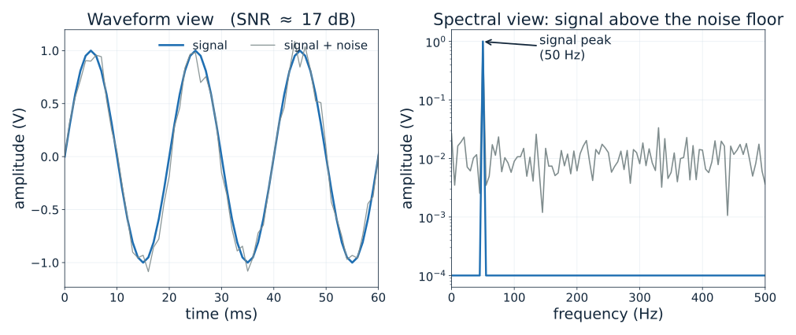{width="85%"}

::: {.notes}
For the illustrative example shown, the signal is a 1 V peak sine and the noise
has an RMS value of 0.1 V, giving an SNR of about 17 dB. Point out that the
time-domain view alone does not tell you the SNR — the spectral view makes it
obvious.
:::

## Improving the Signal-to-Noise Ratio

::: {.fragment}
**1. Reduce the bandwidth**

Narrow-band measurement rejects out-of-band noise power.
:::

::: {.fragment}
**2. Average $M$ measurements**

For uncorrelated noise, $\mathrm{SNR}$ improves by $\sqrt{M}$ (that is, $+3$ dB
per doubling of $M$).
:::

::: {.fragment}
**3. Use a differential / bridge front end**

Common-mode interference is rejected by the difference amplifier.
:::

::: {.fragment}
**4. Amplify early**

The amplifier's own noise is referred to the input, so gain placed before the
noise source dominates the budget.
:::

::: {.fragment}
**5. Shield, twist and ground carefully**

Reduces mains pick-up and ground loops before they enter the channel.
:::

::: {.notes}
Ask: "Averaging 100 readings improves SNR by how much?" — by a factor of 10,
i.e. +20 dB. Link this back to DSP: averaging is a digital operation.
:::

# 2.4 Digital Signal Processing

## From Analog to Digital Processing

Once the signal is a sequence of numbers, we can do things that are difficult,
expensive or impossible in analog hardware:

- Exact, repeatable filtering with arbitrary response
- Storage and retrieval without degradation
- Averaging, correlation and statistical analysis
- Fourier analysis and spectral estimation
- Adaptive and self-calibrating algorithms

**Trade-off:** the signal must cross the analog-to-digital boundary, and that
boundary is where resolution and bandwidth are lost.

::: {.notes}
Stress that DSP is not "better analog". It solves a different class of problem:
it is repeatable, reconfigurable and cheap once the hardware exists.
:::

## The DSP Workflow

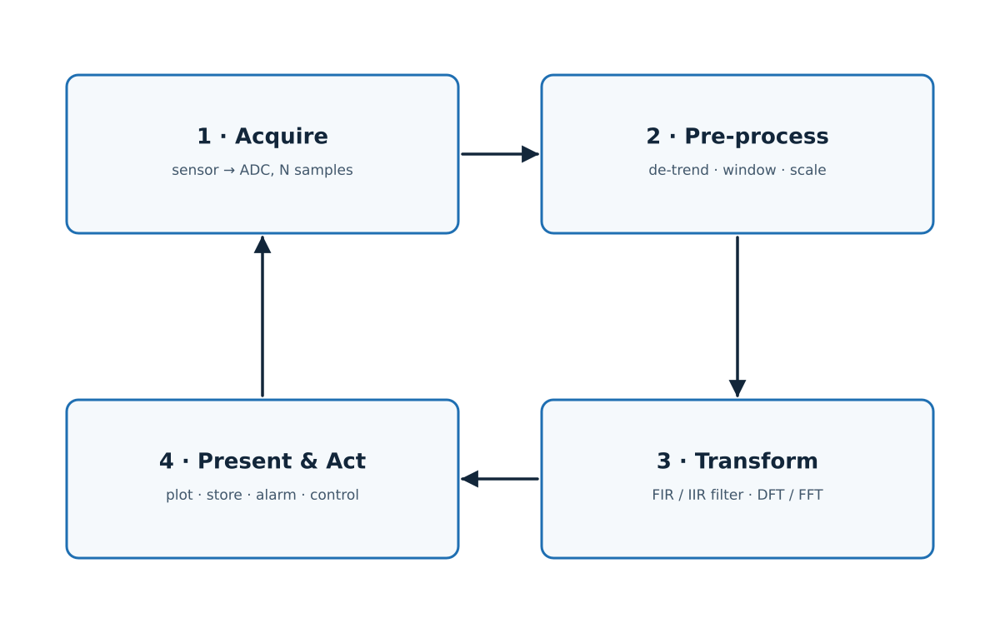{width="62%"}

::: {.notes}
Four stages, executed as a cycle. In embedded instruments stages 1–3 run in
real time, while stage 4 may run at a slower rate. Point out that
pre-processing (removing the mean, windowing) has a large effect on the quality
of the spectral estimate that follows.
:::

## Digital Filtering Demonstrated

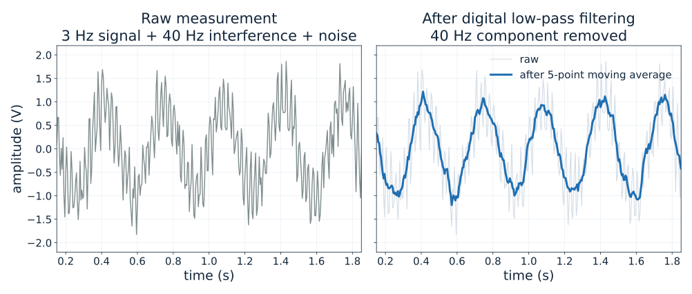{width="85%"}

::: {.notes}
The raw trace contains a 3 Hz measurement, a strong 40 Hz interference and
white noise. A five-point moving average has a null exactly at $f_s/5 = 40$ Hz,
so the interference is removed completely while the 3 Hz signal survives and
the random noise is reduced by $\sqrt{5}$.
:::

## DSP Versus Analog Processing

| Aspect | Analog processing | Digital processing |
|:---|:---|:---|
| Filter response | Limited by component tolerances | Exact and repeatable |
| Reconfiguration | Re-solder / re-design | Change coefficients |
| Drift and ageing | Yes | No |
| Storage | Not possible | Trivial |
| Speed | Instantaneous | Limited by clock and $N$ |
| Power | Usually low | Higher for high rates |
| Resolution limit | Thermal noise | Quantisation + clock jitter |

::: {.notes}
Most instruments use both: an analog anti-aliasing filter in front of the ADC,
and the rest of the filtering in software.
:::

# 2.5 Fourier Transform

## The Fourier Idea

Any physically realisable signal can be written as a sum of sinusoids.

$$x(t) = \sum_{k} A_k \sin(2\pi f_k t + \phi_k)$$

The **Fourier transform** finds the amplitudes $A_k$ and phases $\phi_k$ that
build the signal — it converts a description in **time** into a description in
**frequency**.

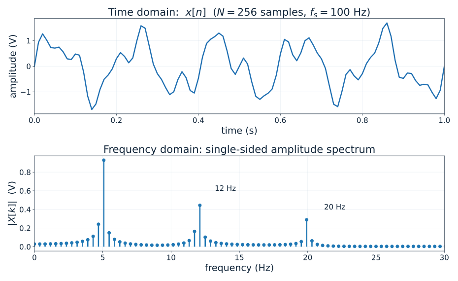{width="68%"}

::: {.notes}
Use the figure to show that three sinusoids that are hard to separate in the
time domain become three obvious spikes in the frequency domain. This is the
core motivation for all spectral measurement.
:::

## The Discrete Fourier Transform

For a sequence $x[0], x[1], \dots, x[N-1]$ sampled at $f_s$:

$$X[k] = \sum_{n=0}^{N-1} x[n]\, e^{-j 2\pi k n / N}, \qquad k = 0, 1, \dots, N-1$$

- $X[k]$ is **complex**: $|X[k]|$ gives amplitude, $\angle X[k]$ gives phase
- Bin $k$ corresponds to frequency $f_k = k\,f_s/N$
- The frequency spacing is the **resolution** $\Delta f = f_s/N = 1/T_{record}$
- The direct evaluation needs $N^2$ complex operations

::: {.notes}
Emphasise the physical meaning of $\Delta f$: the longer you record, the finer
the frequency resolution. This is not a computational detail — it is a
fundamental limit set by the observation time.
:::

## The Fast Fourier Transform

The FFT is **not a different transform** — it is an efficient algorithm for
computing exactly the same DFT.

**Divide-and-conquer (radix-2):** split an $N$-point DFT into two $N/2$-point
DFTs, then repeat.

$$T_{DFT} \approx N^2 \qquad\qquad T_{FFT} \approx N\log_2 N$$

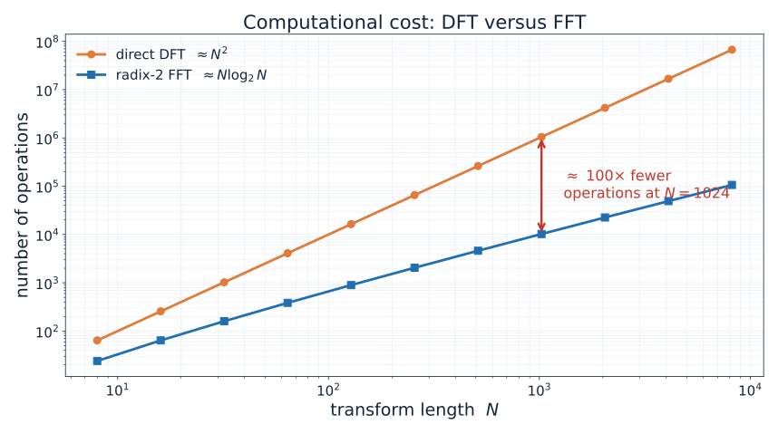{width="70%"}

::: {.notes}
The output of the FFT is identical to the output of the DFT. Only the number of
arithmetic operations changes. For $N = 1024$ that is 1,048,576 operations
versus about 10,240 — roughly a hundredfold saving.
:::

## FFT — Worked Example

**Given**

- Sampling frequency $f_s = 10$ kHz
- Record length $N = 1024$ samples (a power of two)

**Required** — frequency resolution, record duration and the computational
saving of the FFT.

**Calculation**

$$T_{record} = \frac{N}{f_s} = \frac{1024}{10\,000} = 0.1024\ \text{s}$$

$$\Delta f = \frac{f_s}{N} = \frac{10\,000}{1024} = 9.77\ \text{Hz}$$

$$N^2 = 1024^2 = 1\,048\,576 \qquad N\log_2 N = 1024 \times 10 = 10\,240$$

**Interpretation** — the FFT needs about **100 times fewer operations** for the
same result. Two tones 9.77 Hz apart can just be resolved; closer tones require
a longer record, not a faster algorithm.

::: {.notes}
The resolution limit is set by the record length, not by the algorithm. Ask
students how long a record is needed to resolve 1 Hz — answer: 1 second,
regardless of $f_s$.
:::

## Animation — Fourier Synthesis

A square wave is built up from its odd harmonics, one term at a time.

<video src="figures/fourier_synthesis.mp4" controls loop muted width="1050"></video>

::: {.notes}
Optional animation (rendered with `python lecture.py --manim`). It shows that
adding harmonics progressively sharpens the edges, and that the ripple near the
discontinuity (the Gibbs phenomenon) never disappears — it only narrows.
If the video is not available, demonstrate the same idea on the board with the
partial sums of $\sum 4\sin(kx)/(\pi k)$.
:::

# 2.6 Inverse Fourier Transform

## From Spectrum Back to Signal

The **inverse discrete Fourier transform** reconstructs the time-domain sequence
from its spectrum:

$$x[n] = \frac{1}{N}\sum_{k=0}^{N-1} X[k]\, e^{+j 2\pi k n / N}, \qquad n = 0, 1, \dots, N-1$$

- The forward transform is **analysis** — what frequencies are present?
- The inverse transform is **synthesis** — rebuild the waveform
- The only differences are the sign of the exponent and the $1/N$ factor

::: {.notes}
Point out the symmetry: analysis and synthesis are the same operation with a
sign flip. This is why the FFT routine can compute both — only the sign of the
twiddle factor changes.
:::

## Reconstruction and Spectral Truncation

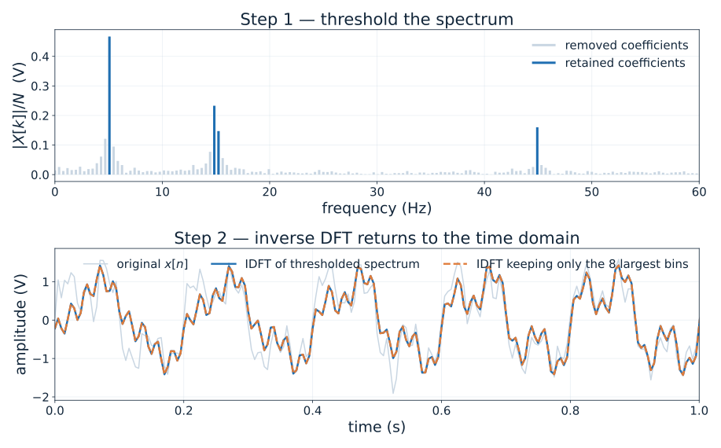{width="68%"}

::: {.notes}
Thresholding the spectrum and inverting gives back the signal with the noise
removed. Keeping only the eight largest bins produces a heavily smoothed
version — still recognisable, but the sharp detail is gone. This is exactly how
data compression and denoising work.
:::

## Why the Inverse Transform Matters

- **Denoising** — zero the bins that carry only noise, then invert
- **Data compression** — store only the significant coefficients
- **Filtering** — multiply the spectrum by a transfer function, then invert
- **System identification** — divide the output spectrum by the input spectrum
- **Interpolation and resampling** — zero-pad the spectrum and invert

A common practical warning:

> Filtering in the frequency domain is **circular**. Without zero padding, the
> end of the record wraps around and corrupts the beginning.

::: {.notes}
Circular convolution is a classic source of confusing artefacts. The standard
cure is to zero-pad to at least the length of the record plus the filter
impulse response.
:::

# 2.7 Data Presentation

## Presenting Measurement Data

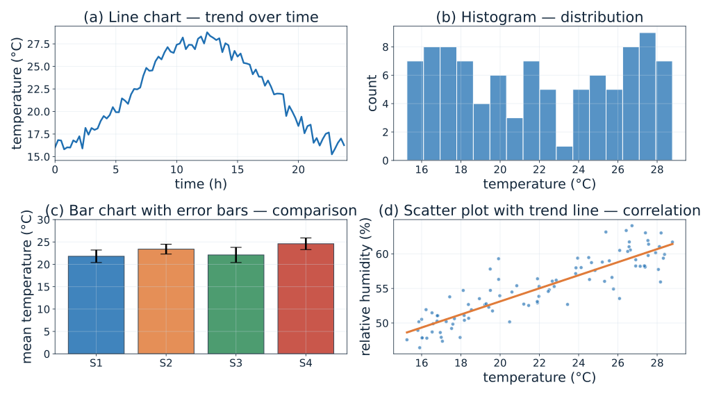{width="88%"}

::: {.notes}
Each panel answers a different question:
(a) how does it change over time?
(b) how are the values distributed?
(c) which sensor is different?
(d) are two quantities related?
Choosing the chart is choosing the question.
:::

## Choosing the Right Presentation

| You want to show… | Use | Avoid |
|:---|:---|:---|
| Change over time | Line chart | Pie chart |
| Comparison of categories | Bar chart with error bars | 3-D bar chart |
| Distribution of values | Histogram, box plot | Averages only |
| Relationship between two variables | Scatter plot with trend | Two separate bars |
| Frequency content | Amplitude spectrum | Time-domain overlay |
| Exact values | Table | — |

**Rules that matter in practice**

- Always label axes **with units**
- State the uncertainty or error bars
- Start bar charts at zero; line charts need not
- Do not rely on colour alone — use line style, marker shape and direct labels

::: {.notes}
Show a deliberately bad chart and ask what is wrong with it. Common faults:
truncated bar axis, missing units, colour-only encoding, chart junk.
:::

# Wrap-Up

## Common Misconceptions

::: {.fragment}
**"A higher sampling rate always gives a better measurement."**
Not if the anti-aliasing filter is missing — it only moves the alias.
:::

::: {.fragment}
**"The bridge output is linear in $\Delta R$."**
Only for small $\Delta R/R$; the exact expression is
$(V_s/4)\cdot(\Delta R/R)/(1+\Delta R/2R)$.
:::

::: {.fragment}
**"The FFT is a different transform from the DFT."**
It is exactly the same transform computed with fewer operations.
:::

::: {.fragment}
**"More bits always mean a better measurement."**
Quantisation is only one term; thermal noise, drift and interference may
dominate long before 24 bits.
:::

::: {.fragment}
**"Noise can be removed completely."**
Random noise can be reduced by bandwidth limiting and averaging, never removed.
:::

::: {.notes}
Ask students to state which misconception they held before the lecture.
:::

## Conceptual Questions

1. An accelerometer signal contains components up to 800 Hz. Choose a sampling
   rate and justify it.

2. A quarter-bridge strain gauge with $R = 120\ \Omega$, $GF = 2.1$ and
   $V_s = 10$ V measures $\varepsilon = 1000\ \mu\varepsilon$. Find $V_o$.

3. A measurement has a 2 V RMS signal and 20 mV RMS noise. What is the SNR in
   dB?

4. Why does a longer record improve frequency resolution but not the SNR of
   every individual bin?

5. Give one measurement situation where a bar chart is more appropriate than a
   line chart, and explain why.

::: {.notes}
Answers: (1) $f_s > 1600$ Hz; 2–5 kHz is a practical choice.
(2) $\Delta R/R = 2.1\times10^{-3}$; $V_o = (10/4)\times2.1\times10^{-3}
= 5.25$ mV. (3) $20\log_{10}(2/0.02) = 40$ dB.
(4) Resolution depends on observation time; averaging is what reduces the
variance of each estimate. (5) Comparing discrete categories such as
sensors or batches — there is no continuity between the categories.
:::

## Summary

:::: {.columns}
::: {.column width="50%"}
- A **signal** carries information; it can be analog, discrete-time or digital
- A digital signal is characterised by $f_s$, $N$ bits, $\Delta$ and $\Delta f$
- The **sampling theorem** $f_s > 2f_{max}$ must be satisfied *before* the ADC
- The **Wheatstone bridge** converts a resistance change into a voltage and
  outputs zero at balance
:::
::: {.column width="50%"}
- **Noise** limits every measurement; SNR quantifies the limit
- **DSP** replaces drift-prone analog processing with exact algorithms
- The **DFT** converts time to frequency; the **FFT** computes it efficiently
- The **inverse DFT** converts frequency back to time
- **Data presentation** must match the question being asked
:::
::::

::: {.notes}
Close by returning to the acquisition chain figure: every block in that chain
was covered in this chapter.
:::

## References

- Bentley, J. P. *Principles of Measurement Systems*, 4th ed., Pearson.
- Doebelin, E. O. *Measurement Systems: Application and Design*, 5th ed., McGraw-Hill.
- Oppenheim, A. V. and Schafer, R. W. *Discrete-Time Signal Processing*, 3rd ed., Pearson.
- Proakis, J. G. and Manolakis, D. G. *Digital Signal Processing*, 4th ed., Pearson.
- Smith, S. W. *The Scientist and Engineer's Guide to Digital Signal Processing*, California Technical Publishing.
- National Instruments, *Measurement Fundamentals* — application notes on signal conditioning and bridge circuits.
- Analog Devices, *Linear Circuit Design Handbook* — chapters on sensors, bridges and noise.

::: {.notes}
Point students to Smith's book — it is freely available online and is the
gentlest introduction to the DFT and FFT.
:::